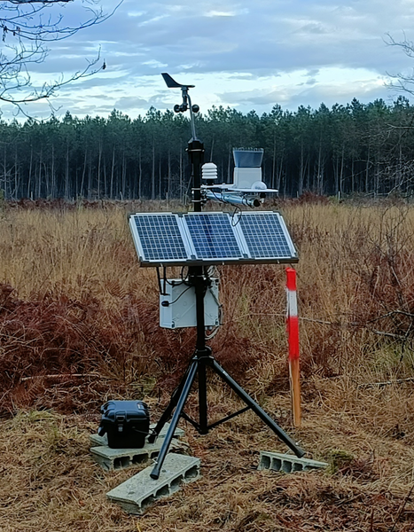

# Ecologging
Ecologging est un projet de station instrumentée connectée, fiable et évolutive.

Ecologging is a project for a connected, reliable and scalable instrumented station.

## Description
Le projet ECOLOGGING a vu le jour pour proposer une solution alternative aux stations commerciales déjà existantes. La station ECOLOGGING est moins chère, et permet de relever plusieurs paramètres météorologiques (Température, Humidité relative, Vitesse et orientation du vent, Rayonnement, Luminosité et Cumul de pluie) mais aussi humidité du sol, hauteur de nappe, etc. Tout en gardant un rapport qualité coût de la donnée très intéressant, une attention particulière a été portée sur la modularité, l'accessibilité, la réparabilité et l'open-source.
La station utilise comme microcontrolleur un ARDUINO MEGA 2560 associé à une carte SD pour le stockage local des données, des capteurs choisis pour leur bon rapport coût/performance et un HAT SIM 7600G 4G pour la transmission 4G.
La transmission utilise le protocole MQTT avec support SSL et authentification login/password.
Un tampon mémoire paramétrable est utilisé pour stocker les données devant être transmises en cas de perte temporaire du réseau 4G.

The ECOLOGGING project was created to offer an alternative to existing commercial weather stations. The ECOLOGGING station is less expensive and allows for the measurement of several meteorological parameters (temperature, relative humidity, wind speed and direction, radiation, brightness, and rainfall totals), as well as soil moisture, groundwater level, and more. While maintaining a very attractive data quality-to-cost ratio, particular attention has been paid to modularity, accessibility, repairability, and open-source principles.
The station uses an Arduino Mega 2560 microcontroller paired with an SD card for local data storage, sensors chosen for their cost/performance ratio, and a 7600G 4G HAT SIM for 4G transmission.
Transmission uses the MQTT protocol with SSL support and login/password authentication.
A configurable memory buffer is used to store data to be transmitted in case of a temporary loss of the 4G.

## Capteurs supportés / Supported Sensors

***T°, Humidity , P°*** :thermometer: :droplet:
- BME280 / ADA2652  (T°, Humidity, P°)
- SHT31 / SEN0385   (T°, Humidity)
- SHT20 / SEN0227   (T°, Humidity)
- Davis 6830        (T°, Humidity)

***Radiation*** :high_brightness:
- VEML7700 / ADA4162  (Luminosity Luxmeter)
- Davis 6450          (Pyranometer)

***Soil sensors*** :seedling:
- DS18B20   (T° waterproof)
- SEN0308   (capacitive soil moisture sensor)
- SENO600   (T° & conductivity soil moisture sensor)

***Rain & Water level*** :cloud_with_rain: :droplet:
- LEXCA001  (tipping rain gauge)
- Davis 6466    (tipping rain gauge)
- Campbell ARG100   (tipping rain gauge)
- Gravity KIT0139   (Water Level)

***Wind*** :compass: :dash:
- Davis 6410  (Anemometer / Weathervane)
- Davis 6415  (Anemometer / Weathervane 2D)

***Datas*** :floppy_disk:
- microSD DFR0229

***Date & Time*** :watch:
- DS3231 / ADA3013  (RTC)
- Gravity TEL0157   (GNSS GPS)

***Transmission*** :satellite:
- SIM7600G-H / TEL0124  (4G,LTE,3G,2G GSM shield)
- KIM2 Kineis module    (satellite transmission)

## Badges

## Installation
Le code peut être chargé sur l'arduino Mega avec l'IDE Arduino.
NOTE: Compte tenu des ressources mémoires nécessaires, le choix d'un Arduino Mega est requis.
Pour la communication MQTT avec SSL il est nécessaire de charger au préalable les clés de cryptage dans le module SIM 7600G depuis un serveur FTP.
Les documents relatifs à la réalisation matérielle de la station sont accessible sur hal, notamment dans le document [Tutoriel](https://hal.science/hal-05162126v2)

The code can be uploaded to the Arduino Mega using the Arduino IDE.
NOTE: Due to the memory requirements, an Arduino Mega is mandatory.
For MQTT communication with SSL, the encryption keys must first be uploaded to the SIM 7600G module from an FTP server.
Documents relating to the hardware implementation of the station are available on HAL, particularly in the [Tutorial](https://hal.science/hal-05162126v2) document.

## Usage
Il est nécessaire de paramétrer un certain nombre de valeurs dans les fichiers suivants :

_ config.h > selection des capteurs installés, de la périodicité des acquisitions / moyennes, du nom du topic si envoi en 4G
_ SIM7600MQTTparam.h > parmétrage des informations de connexion au serveur

_ buffer_pile.h > nombre de données gardées en mémoire tampon (NUM_BUFFERED)
_ capteurs_meteo.h > paramétrage des capteurs (GPIO utilisés)

Several values ​​need to be configured in the following files:

_ config.h > selection of installed sensors, acquisition frequency/averages, topic name if sending via 4G
_ SIM7600MQTTparam.h > server connection information settings

_ buffer_pile.h > number of data points kept in buffer memory (NUM_BUFFERED)
_ sensor_meteo.h > sensor settings (GPIO used)

## GPIO pinout
| **GPIO** | **Reserved** | **Reserved** | **Ecologging 20260918** | **Remarks** |
| :--- | :--- | :--- | :--- | :--- |
| **D0** | :orange_circle: UART0_RX | _ | _ | _ |
| **D1** | :orange_circle: UART0_TX | _ | _ | _ |
| <mark>**D2**</mark> | _ | :black_circle: INT4 | :dash: Anemometer | _ |
| **<mark>D3</mark>** | _ | :black_circle: INT5 | :watch: GNSS relay command (plug) | _ |
| **D4** | _ | _ | :satellite: KIM2 Sat Power command | :purple_square: |
| **<mark>D5</mark>** | _ | _ | :satellite: SIM7600 4G / KIM2 relay (plug) | :green_square: :purple_square: |
| **<mark>D6</mark>** | _ | _ | :cloud_with_rain: Rain gauge | _ |
| **D7** | _ | _ | :satellite: KIM2 Sat TX (jumper) | :purple_square: |
| **D8** | _ | _ | :satellite: KIM2 Sat RX (jumper) | :purple_square: |
| **<mark>D9</mark>** | _ | _ | :thermometer: DS18B20 | _ |
| D10 | :brown_circle: SPI_SS | _ | _ | _ |
| D11 | :brown_circle: SPI_MOSI | Timer1 | _ | :dash: *Anemometer/Timer1* |
| **D12** | :brown_circle: SPI_MISO | Timer1 | :satellite: SIM7600 4G Power (fix) :purple_square: | :dash: *Anemometer/Timer1* |
| D13 | :brown_circle: SPISCK | Integrated LED | _ | _ |
| **<mark>D14</mark>** | :orange_circle: UART3_TX | _ | :seedling: Soil Probe RSS485 | _ |
| **<mark>D15</mark>** | :orange_circle: UART3_RX | _ | :seedling: Soil Probe RSS485 | _ |
| D16 | :orange_circle: UART2_TX | _ | _ | _ |
| D17 | :orange_circle: UART2_RX | _ | _ | _ |
| **D18** | :orange_circle: UART1_TX | :black_circle: INT3 | :satellite: SIM7600 4G / Kim2 Sat RX | :green_square: :purple_square: |
| **D19** | :orange_circle: UART1_RX | :black_circle: INT2 | :satellite: SIM7600 4G / Kim2 Sat TX | :green_square: :purple_square: |
| **<mark>D20</mark>** | :yellow_circle: I2C_SDA | :black_circle: INT1 | :repeat: I2C capteurs | _ |
| **<mark>D21</mark>** | :yellow_circle: I2C_SCL | :black_circle: INT0 | :repeat: I2C capteurs | _ |
| D22 | _ | _ | _ | _ |
| D23 | _ | _ | _ | _ |
| D24 | _ | _ | _ | _ |
| D25 | _ | _ | _ | _ |
| D26 | _ | _ | _ | _ |
| <mark>**D27**</mark> | _ | _ | :seedling: Soil Probe RSS485 | _ |
| D28 | _ | _ | _ | _ |
| D29 | _ | _ | _ | _ |
| D30 | _ | _ | _ | _ |
| D31 | _ | _ | _ | _ |
| D32 | _ | _ | _ | _ |
| D33 | _ | _ | _ | _ |
| D34 | _ | _ | _ | _ |
| D35 | _ | _ | _ | _ |
| D36 | _ | _ | _ | _ |
| D37 | _ | _ | _ | _ |
| D38 | _ | _ | _ | _ |
| D39 | _ | _ | _ | _ |
| D40 | _ | _ | _ | _ |
| D41 | _ | _ | _ | _ |
| D42 | _ | _ | _ | _ |
| D43 | _ | _ | _ | _ |
| D44 | _ | _ | _ | _ |
| D45 | _ | _ | _ | _ |
| D46 | _ | _ | _ | _ |
| D47 | _ | _ | _ | _ |
| D48 | _ | _ | _ | _ |
| D49 | _ | _ | _ | _ |
| **<mark>D50</mark>** | :yellow_circle: SPI_MISO | _ | :floppy_disk: uSD | _ |
| **<mark>D51</mark>** | :yellow_circle: SPI_MOSI | _ | :floppy_disk: uSD | _ |
| **<mark>D52</mark>** | :yellow_circle: SPISCK | _ | :floppy_disk: uSD | _ |
| **<mark>D53</mark>** | :yellow_circle: SPI_SS | _ | :floppy_disk: uSD | _ |
| A0 | _ | _ | _ | _ |
| **<mark>A1</mark>** | _ | _ | :high_brightness: Pyranometer | _ |
| A2 | _ | _ | _ | _ |
| A3 | _ | _ | _ | _ |
| **<mark>A4</mark>** | _ | _ | :compass: Weathervane | _ |
| A5 | _ | _ | _ | _ |
| A6 | _ | _ | _ | _ |
| A7 | _ | _ | _ | _ |
| A8 | _ | _ | _ | _ |
| A9 | _ | _ | _ | _ |
| A10 | _ | _ | _ | _ |
| A11 | _ | _ | _ | _ |
| A12 | _ | _ | _ | _ |
| A13 | _ | _ | _ | _ |
| A14 | _ | _ | _ | _ |
| A15 | _ | _ | _ | _ |

## Project information
Toute la documentation est disponible sur HAL [https://hal-lara.archives-ouvertes.fr/search/index?q=ecologging](https://hal-lara.archives-ouvertes.fr/search/index?q=ecologging)

All documentation is available on HAL [https://hal-lara.archives-ouvertes.fr/search/index?q=ecologging](https://hal-lara.archives-ouvertes.fr/search/index?q=ecologging)

## Support
pierre.bordenave@inrae.fr
philippe.chaumeil@inrae.fr

## Roadmap
Support for Lorawan connectivity
Support for Satellite connectivity

## Authors and acknowledgment
Pierre Bordenave (UEFP - INRAe Cestas Pierroton) pierre.bordenave@inrae.fr
Philippe Chaumeil (Biogeco - INRAe Cestas Pierroton) philippe.chaumeil@inrae.fr

## License
GNU GPL

## Project status
Développement et test en cours.
